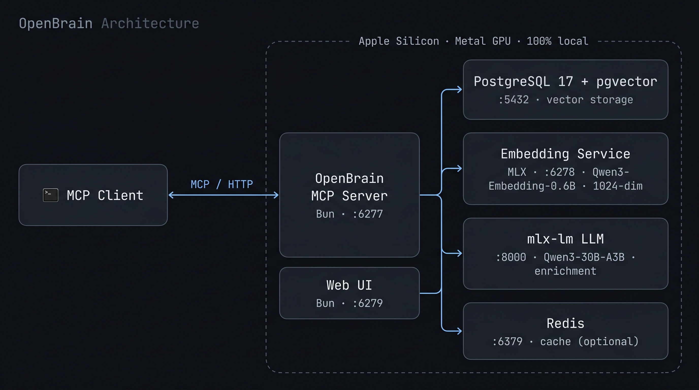

# OpenBrain

Fully local AI memory for Apple Silicon. Gives any MCP client persistent semantic memory with vector search — no cloud APIs required.

Everything runs on your Mac: embeddings via MLX on Metal GPU, enrichment via a local LLM, storage in PostgreSQL with pgvector.

Built on the [OB1](https://github.com/NateBJones-Projects/OB1) architecture by [@NateBJones-Projects](https://github.com/NateBJones-Projects).

## Architecture



A Bun MCP server brokers requests from any MCP client to PostgreSQL+pgvector for storage, a local MLX embedding service for vectorization, and a local mlx-lm server for enrichment. Redis caches embeddings and search results. A separate Bun web UI reads directly from PostgreSQL. Everything runs on-device — no cloud APIs in the data path.

## Requirements

- **Apple Silicon Mac** (M1/M2/M3/M4) — required for MLX GPU inference
- **16 GB RAM minimum** for the default model (`Qwen3-8B-4bit`, ~4.5 GB); 32 GB+ lets you run larger enrichment models
- macOS 14+
- [Node.js](https://nodejs.org) 22+ (LTS v24 recommended) and [pnpm](https://pnpm.io) 11+
- [Bun](https://bun.sh) 1.1+ as the runtime (we use `pnpm` to install deps; `bun` to run them)
- Python 3.13+ with [uv](https://docs.astral.sh/uv/)
- [PostgreSQL 17](https://www.postgresql.org/) with [pgvector](https://github.com/pgvector/pgvector) extension
- [Redis](https://redis.io/) (optional but recommended)
- [Obscura](https://github.com/h4ckf0r0day/obscura) — local web scraping (the only scraper enabled by default)
- [yt-dlp](https://github.com/yt-dlp/yt-dlp) (optional — YouTube transcript extraction)

### Optional: cloud fallback

[Firecrawl](https://firecrawl.dev) is supported as a cloud fallback for sites that Obscura can't reach (paywalls, JS-heavy SPAs, etc.) but is **off by default** to keep the install fully local. To enable, set in `.env`:

```
ENABLE_FIRECRAWL=true
FIRECRAWL_API_KEY=fc-...
```

### Quick install (recommended)

```bash
bash installer/bootstrap.sh
```

This runs the full chain: prerequisites (Homebrew packages, Bun, Python venv with `mlx-lm`), database setup, schema, and launchd services. Idempotent — safe to re-run.

### Manual install

If you'd rather install the prerequisites yourself:

```bash
# Homebrew packages
brew install postgresql@17 pgvector redis uv yt-dlp pnpm
brew services start postgresql@17
brew services start redis

# Node 22+ via nvm (skip if you already have one)
curl -o- https://raw.githubusercontent.com/nvm-sh/nvm/v0.40.1/install.sh | bash
. ~/.nvm/nvm.sh && nvm install --lts && nvm alias default 'lts/*'

# Optional, for Gmail integration via the agents/ subsystem
brew install gogcli

# Bun via its official installer (no Homebrew formula). We use Bun as the
# runtime (Bun.serve, Bun.spawn) but never `bun install` — that hits a
# macOS SIP/provenance issue. pnpm handles deps.
curl -fsSL https://bun.sh/install | bash
```

After installing Bun, restart your shell (or `source ~/.zshrc`) so the `bun` binary is on your `PATH`.

## Quick Start

```bash
# 1. Clone and enter the repo
git clone https://github.com/sajennings79/apple-silicon-openbrain.git
cd apple-silicon-openbrain

# 2. Configure environment
cp .env.example .env
# Edit .env if needed (defaults work for local setup)

# 3. Run setup (creates database, installs Bun + Python deps)
bash scripts/setup.sh

# 4. Create a Python venv for the LLM enrichment server
python3 -m venv ~/.mlx-venv
~/.mlx-venv/bin/pip install mlx-lm

# 5. Start all services (installs as launchd daemons)
bash scripts/install-services.sh

# 6. Verify everything is running
bun run health
```

Or start services manually:

```bash
bun run dev                                    # MCP server (port 6277)
cd embed-service && uv run server.py           # Embedding service (port 6278)
~/.mlx-venv/bin/python -m mlx_lm.server \
  --model mlx-community/Qwen3-8B-4bit \
  --port 8000 --max-tokens 4096               # LLM enrichment (port 8000)
bun run ui                                     # Web UI (port 6279)
```

## First Run: Model Downloads

Models are pulled from Hugging Face Hub the first time each service starts — there's no separate download step. Both services block on startup until the download completes, then come online.

| Model | Size | Used by | Triggered by |
|-------|------|---------|--------------|
| `mlx-community/Qwen3-Embedding-0.6B-4bit-DWQ` | ~400 MB | Embedding service (`:6278`) | FastAPI startup |
| `mlx-community/Qwen3-8B-4bit` (default) | ~4.5 GB | LLM enrichment (`:8000`) | `mlx_lm.server` startup |

The default LLM is sized for 16 GB RAM systems. To trade RAM for quality, override `LLM_MODEL` in `.env` (and the matching `--model` arg in `~/Library/LaunchAgents/com.openbrain.llm.plist`):

| RAM | Suggested model | Disk |
|-----|-----------------|------|
| 16 GB (default) | `mlx-community/Qwen3-8B-4bit` | ~4.5 GB |
| 32 GB | `mlx-community/Qwen3.6-35B-A3B-4bit` | ~17.5 GB |
| 64 GB+ | `mlx-community/Qwen3.5-122B-A10B-4bit` | ~60 GB |

All models are public repos — no Hugging Face token required. Files cache to `~/.cache/huggingface/hub/` and subsequent starts run fully offline.

If you installed the launchd services, the first-run download happens silently in the background. Watch progress with:

```bash
tail -f logs/embed.log   # embedding model (~30s on fast connection)
tail -f logs/llm.log     # ~2 min for the default 8B model on a fast connection
```

`bun run health` will report the LLM service as down until its download finishes. Interrupted downloads resume on the next start.

## MCP Client Configuration

OpenBrain exposes both HTTP and stdio MCP transports. Configure your client to point at whichever it supports.

**HTTP transport** (recommended — one shared server for all clients):

```json
{
  "mcpServers": {
    "openbrain": {
      "type": "http",
      "url": "http://localhost:6277/mcp"
    }
  }
}
```

**stdio transport** (for clients that spawn the server as a subprocess):

```json
{
  "mcpServers": {
    "openbrain": {
      "type": "stdio",
      "command": "bun",
      "args": ["run", "/path/to/openbrain/src/stdio.ts"]
    }
  }
}
```

The exact config-file location depends on your client (e.g. `.mcp.json` in a project root, or a global config under your home directory).

## MCP Tools

| Tool | Description |
|------|-------------|
| **StoreMemory** | Store text with automatic embedding, LLM enrichment (summary, tags, entities), and cross-memory linking |
| **SearchMemory** | Semantic vector search with optional filters (type, source, tags, date range) |
| **RecallMemory** | Retrieve a specific memory by UUID |
| **ListMemories** | Paginated list with filters |
| **UpdateMemory** | Update content or metadata; re-embeds and re-enriches on content changes |
| **DeleteMemory** | Soft-delete a memory by UUID |

## Services

| Service | Port | Purpose |
|---------|------|---------|
| MCP Server | 6277 | MCP protocol + URL ingestion API |
| Embedding Service | 6278 | Local MLX embeddings (Qwen3-Embedding-0.6B, 1024-dim) |
| LLM Server | 8000 | Local MLX enrichment (Qwen3-8B by default) |
| Web UI | 6279 | Dashboard for browsing and searching memories |
| PostgreSQL | 5432 | Memory storage with pgvector |
| Redis | 6379 | Embedding + search result caching |

## Web UI

The web UI at `http://localhost:6279` provides:

- Memory search and browsing with tag/source/type filters
- Dashboard with statistics (total memories, per source, per type)
- Monthly histogram and 30-day sparkline
- New memory creation form
- Tag management

## URL Ingestion

Save web pages and YouTube transcripts directly to memory using the bookmarklet.

1. Open `scripts/bookmarklet.html` in your browser
2. Drag the bookmarklet link to your bookmarks bar
3. Click it on any page to save the content to OpenBrain

**Web pages** are scraped locally via [Obscura](https://github.com/h4ckf0r0day/obscura) (a Rust headless browser — fast, free, no dependencies). If Obscura fails, the request errors by default. To enable [Firecrawl](https://firecrawl.dev) as a cloud fallback, set `ENABLE_FIRECRAWL=true` and `FIRECRAWL_API_KEY` in `.env`.

**YouTube URLs** are handled locally via `yt-dlp` (install: `brew install yt-dlp`). Transcripts are extracted and stored with video metadata.

## Gradual Setup

You don't need all services running to get started:

1. **Minimum**: PostgreSQL + Embedding Service + MCP Server — gives you store and search
2. **Add enrichment**: Start the mlx-lm server — memories get auto-enriched with summaries and tags
3. **Add caching**: Start Redis — faster repeated searches and embedding lookups
4. **Add UI**: Start the web UI — browse and manage memories visually
5. **Add ingestion**: Install Obscura, plus the bookmarklet — save web content from your browser. Optionally also set `ENABLE_FIRECRAWL=true` and `FIRECRAWL_API_KEY` for cloud fallback.

To skip enrichment entirely (e.g., while setting up), set `DISABLE_ENRICHMENT=true` in `.env`.

## Sources (recurring ingestion)

OpenBrain pulls content into memory on a schedule. Each **source** is a row in the `sources` table with a kind (`rss`, `mail`, or `webpage`), config, and an interval.

```bash
# Create an RSS source via the REST API:
echo '{"kind":"rss","name":"HN","config":{"feedUrl":"https://news.ycombinator.com/rss"},"intervalSeconds":3600}' \
  | curl -X POST http://localhost:6277/api/sources -H 'content-type: application/json' --data @-

# Sync now:
curl -X POST http://localhost:6277/api/sources/<id>/sync

# Sync everything that's due:
curl -X POST http://localhost:6277/api/sources/poll-due
```

The Mac app (Phase 3+) drives `poll-due` from a 5-minute timer and exposes a UI for source CRUD. Until then, talk to the REST API directly.

### Mail sources via `gog`

To pull Gmail into memory, install [gogcli](https://github.com/steipete/gogcli) and authenticate:

```bash
brew install gogcli
gog auth add you@gmail.com
```

Then create a `mail` source:

```json
{
  "kind": "mail",
  "name": "Personal Gmail (last day)",
  "config": {
    "account": "you@gmail.com",
    "query": "newer_than:1d -in:promotions -in:spam -in:trash",
    "maxMessages": 25
  },
  "intervalSeconds": 900
}
```

**Important**: launchd-managed services have no TTY for `gog`'s keyring password prompt. Set `GOG_KEYRING_PASSWORD` in `.env` (gitignored) to your gog keyring password, then restart the MCP service. Without this, mail syncs will fail with `"no TTY available for keyring file backend password prompt"`.

## Recurring agents

OpenBrain ships with a small **starter pack** of prompt-driven agents that run on a schedule, query the memory store, call the local LLM, and write the result back as a new memory. All of this happens locally — no API keys.

```bash
# Run a shipped agent once, see the output:
bun run agents/run-agent.ts agents/prompts/newsletter-digest.md

# Or via the wrapper:
agents/run-agent.sh newsletter-digest.md
```

Shipped prompts live in `agents/prompts/`. Bring your own by dropping additional `.md` files into a directory of your choice (the [Mac app](apps/mac/) defaults to `~/Developer/claude-cron/prompts/`). See `agents/prompts/README.md` for the format.

## Remote Access via Tailscale

To access OpenBrain from other devices on your network:

```bash
# Expose MCP server over Tailscale HTTPS
tailscale serve --bg --https=6443 http://localhost:6277
```

Then update your bookmarklet URL to use `https://your-machine.tail-xxxxx.ts.net:6443` and set `AUTH_TOKEN` in `.env` to protect the endpoint.

## Development

```bash
bun run dev          # MCP server with auto-reload
bun run ui           # Web UI
bun run health       # Check all service health
bun run db:generate  # Generate Drizzle migration from schema changes
bun run db:migrate   # Apply pending migrations

# Re-enrich memories missing summaries
bun run scripts/enrich-backlog.ts
```

## Managing Services

```bash
# Install as launchd daemons (auto-start on boot)
bash scripts/install-services.sh

# Uninstall all services
bash scripts/uninstall-services.sh

# Restart a single service
kill $(lsof -ti :6277)  # KeepAlive restarts it automatically

# View logs
tail -f logs/mcp.log
tail -f logs/embed.log
tail -f logs/llm.log
```

## License

MIT
